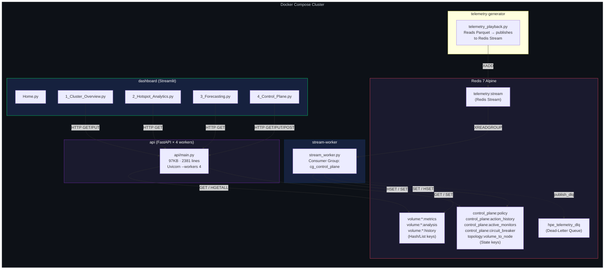
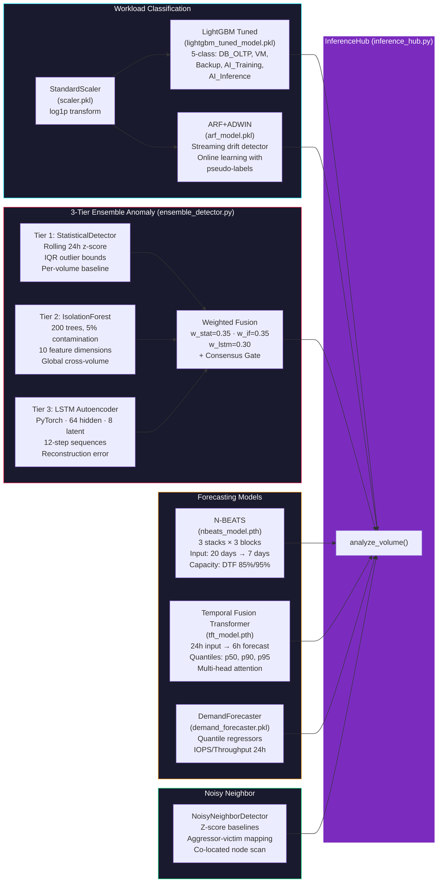
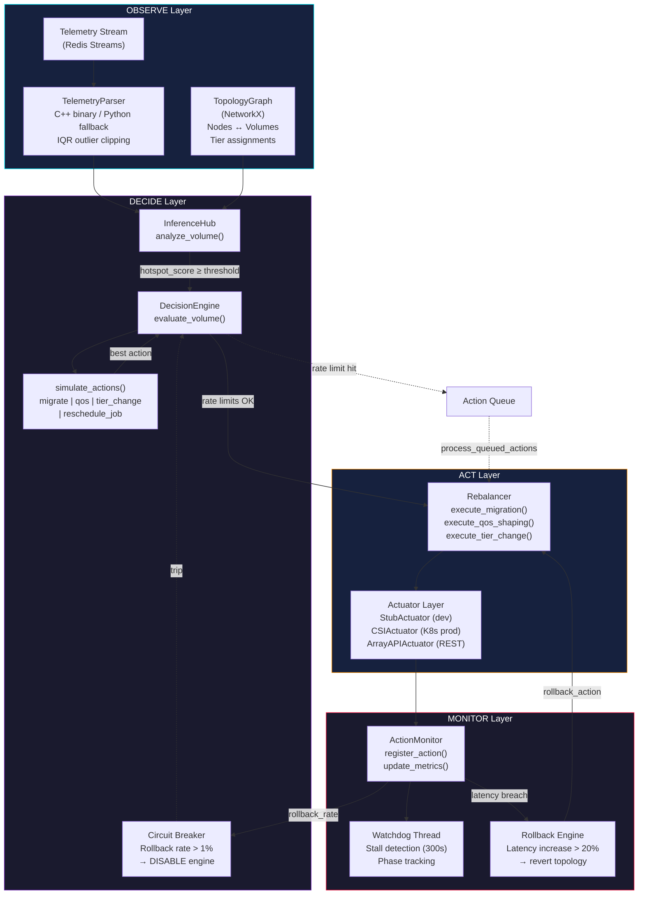
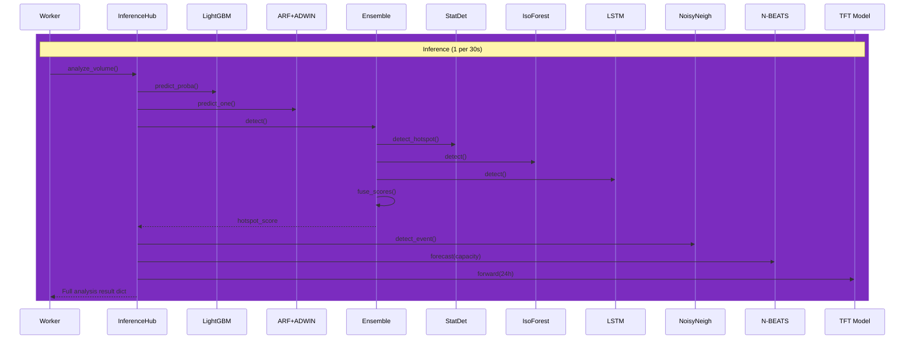
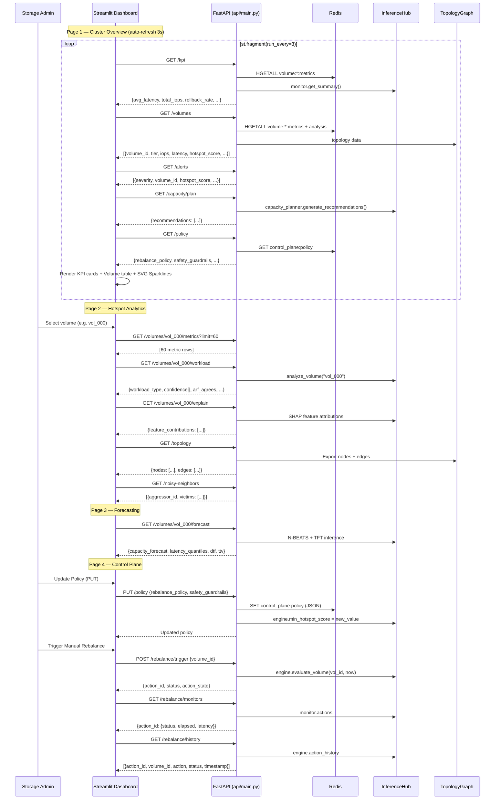
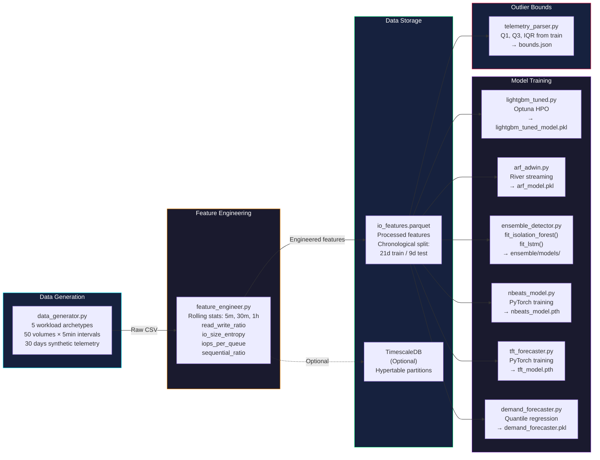
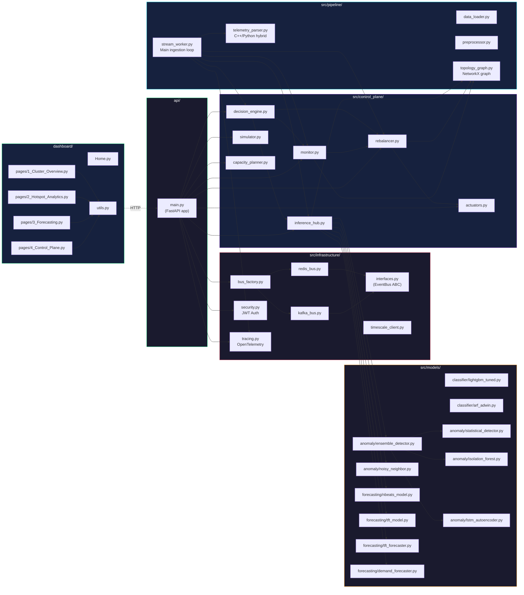

# IO Workload Pattern Classification & Hotspot Detection — Architecture Diagrams

Complete system architecture derived from line-by-line analysis of the full codebase.

---

## 1. High-Level System Block Diagram

This diagram shows every container, module, and data store and how they connect.

---

## 2. ML Model Hierarchy Block Diagram

Shows every trained model, its type, and how they feed into the InferenceHub.

---

## 3. Control Plane Closed-Loop Block Diagram

Shows the full observe → decide → act → monitor feedback loop.

---

## 4. Sequence Diagrams — Telemetry Event to Action

To maintain readability and prevent the diagrams from shrinking, this complex sequence has been broken down into three distinct phases.

### Phase 1: Ingestion & Preprocessing

```mermaid
sequenceDiagram
    participant TG as TelGen
    participant RS as Redis
    participant SW as Worker
    participant TP as Parser
    participant RD as State

    TG->>RS: XADD telemetry:stream
    
    rect rgb(22, 33, 62)
        Note over SW: Consumer Group Loop
        SW->>RS: XREADGROUP
        RS-->>SW: [{msg_id, fields}]
        
        SW->>RD: Sync policy, topology, state
        RD-->>SW: Latest policy
    end

    rect rgb(26, 26, 46)
        Note over SW,TP: Message Processing
        SW->>TP: parse_and_clip()
        TP-->>SW: Clipped dict
        SW->>SW: live_features_df.concat(event)
        SW->>SW: topology.update_metrics()
    end
```

### Phase 2: ML Inference & Anomaly Detection

### Phase 3: Control Plane Decision & Execution

```mermaid
sequenceDiagram
    participant SW as Worker
    participant DE as DecisionEngine
    participant REB as Rebalancer
    participant ACT as Actuator
    participant AM as ActionMonitor
    participant RD as State
    participant RS as Redis

    rect rgb(22, 33, 62)
        Note over SW,AM: Decision & Execution
        SW->>DE: evaluate_volume()
        DE->>DE: simulate_actions()
        
        alt Rate limits OK
            DE->>REB: execute_migration()
            REB->>ACT: execute_move()
            ACT->>AM: update_phase(EXECUTING)
            ACT-->>REB: success
            REB->>REB: Update topology
            DE->>AM: register_action()
        else Rate limit exceeded
            DE->>DE: action_queue.append()
        end
    end

    rect rgb(26, 26, 46)
        Note over SW,AM: Monitoring
        SW->>AM: update_metrics()
        alt Latency increase > 20%
            AM->>REB: rollback_action()
        else Elapsed ≥ timeout
            AM-->>SW: success
        end
    end

    SW->>RD: Persist history
    SW->>RS: XACK msg_id
```

---

## 5. Dashboard ↔ API Sequence Diagram

Shows how each dashboard page queries the FastAPI backend.

---

## 6. Data Flow Block Diagram — Ingestion Pipeline

Shows the complete path from raw Parquet data through feature engineering to model training.

---

## 7. Module Dependency Map

Every Python module and its direct imports within the project.

---

## 8. File-to-Module Summary Table

| Layer | File | Lines | Role |
|-------|------|------:|------|
| **Infrastructure** | [interfaces.py](file:///home/akash-t-s-m/projects-may/akash.t.s.m-projects/IO-Workload-Pattern-Classification-Hotspot-Detection/src/infrastructure/interfaces.py) | 39 | `EventBus` abstract base class |
| | [redis_bus.py](file:///home/akash-t-s-m/projects-may/akash.t.s.m-projects/IO-Workload-Pattern-Classification-Hotspot-Detection/src/infrastructure/redis_bus.py) | 88 | Redis Streams publish/subscribe + DLQ |
| | [security.py](file:///home/akash-t-s-m/projects-may/akash.t.s.m-projects/IO-Workload-Pattern-Classification-Hotspot-Detection/src/infrastructure/security.py) | ~50 | JWT token generation/validation |
| | [tracing.py](file:///home/akash-t-s-m/projects-may/akash.t.s.m-projects/IO-Workload-Pattern-Classification-Hotspot-Detection/src/infrastructure/tracing.py) | ~60 | OpenTelemetry span propagation |
| **Pipeline** | [telemetry_parser.py](file:///home/akash-t-s-m/projects-may/akash.t.s.m-projects/IO-Workload-Pattern-Classification-Hotspot-Detection/src/pipeline/telemetry_parser.py) | 351 | C++/Python hybrid JSON parser + IQR outlier clipping |
| | [topology_graph.py](file:///home/akash-t-s-m/projects-may/akash.t.s.m-projects/IO-Workload-Pattern-Classification-Hotspot-Detection/src/pipeline/topology_graph.py) | ~600 | NetworkX graph: nodes ↔ volumes, tier mgmt, placement |
| | [stream_worker.py](file:///home/akash-t-s-m/projects-may/akash.t.s.m-projects/IO-Workload-Pattern-Classification-Hotspot-Detection/src/pipeline/stream_worker.py) | 618 | Main ingestion loop: consume → parse → infer → decide → persist |
| **ML Models** | [lightgbm_tuned.py](file:///home/akash-t-s-m/projects-may/akash.t.s.m-projects/IO-Workload-Pattern-Classification-Hotspot-Detection/src/models/classifier/lightgbm_tuned.py) | ~400 | Optuna-tuned LightGBM 5-class workload classifier |
| | [arf_adwin.py](file:///home/akash-t-s-m/projects-may/akash.t.s.m-projects/IO-Workload-Pattern-Classification-Hotspot-Detection/src/models/classifier/arf_adwin.py) | ~300 | River ARF + ADWIN drift detection streaming classifier |
| | [statistical_detector.py](file:///home/akash-t-s-m/projects-may/akash.t.s.m-projects/IO-Workload-Pattern-Classification-Hotspot-Detection/src/models/anomaly/statistical_detector.py) | ~350 | Per-volume 24h rolling z-score anomaly detector |
| | [isolation_forest.py](file:///home/akash-t-s-m/projects-may/akash.t.s.m-projects/IO-Workload-Pattern-Classification-Hotspot-Detection/src/models/anomaly/isolation_forest.py) | ~550 | Sklearn Isolation Forest with 10-feature vectors |
| | [lstm_autoencoder.py](file:///home/akash-t-s-m/projects-may/akash.t.s.m-projects/IO-Workload-Pattern-Classification-Hotspot-Detection/src/models/anomaly/lstm_autoencoder.py) | ~1000 | PyTorch LSTM Autoencoder (12-step × 10-feature) |
| | [ensemble_detector.py](file:///home/akash-t-s-m/projects-may/akash.t.s.m-projects/IO-Workload-Pattern-Classification-Hotspot-Detection/src/models/anomaly/ensemble_detector.py) | 1121 | Weighted fusion + consensus gate + meta-learner |
| | [noisy_neighbor.py](file:///home/akash-t-s-m/projects-may/akash.t.s.m-projects/IO-Workload-Pattern-Classification-Hotspot-Detection/src/models/anomaly/noisy_neighbor.py) | ~550 | Aggressor-victim detection via co-located node scan |
| | [nbeats_model.py](file:///home/akash-t-s-m/projects-may/akash.t.s.m-projects/IO-Workload-Pattern-Classification-Hotspot-Detection/src/models/forecasting/nbeats_model.py) | ~360 | Neural Basis Expansion for capacity forecasting |
| | [tft_model.py](file:///home/akash-t-s-m/projects-may/akash.t.s.m-projects/IO-Workload-Pattern-Classification-Hotspot-Detection/src/models/forecasting/tft_model.py) | ~200 | Temporal Fusion Transformer architecture |
| | [tft_forecaster.py](file:///home/akash-t-s-m/projects-may/akash.t.s.m-projects/IO-Workload-Pattern-Classification-Hotspot-Detection/src/models/forecasting/tft_forecaster.py) | ~530 | TFT data prep + hourly aggregation + scaler |
| **Control Plane** | [inference_hub.py](file:///home/akash-t-s-m/projects-may/akash.t.s.m-projects/IO-Workload-Pattern-Classification-Hotspot-Detection/src/control_plane/inference_hub.py) | 578 | Central ML coordinator: loads all models, runs analyze_volume() |
| | [decision_engine.py](file:///home/akash-t-s-m/projects-may/akash.t.s.m-projects/IO-Workload-Pattern-Classification-Hotspot-Detection/src/control_plane/decision_engine.py) | 530 | Policy evaluation, action simulation, rate limiting, circuit breaker |
| | [rebalancer.py](file:///home/akash-t-s-m/projects-may/akash.t.s.m-projects/IO-Workload-Pattern-Classification-Hotspot-Detection/src/control_plane/rebalancer.py) | 228 | Execute/rollback migrations, QoS, tier changes on topology |
| | [monitor.py](file:///home/akash-t-s-m/projects-may/akash.t.s.m-projects/IO-Workload-Pattern-Classification-Hotspot-Detection/src/control_plane/monitor.py) | 269 | Post-action latency tracking, rollback triggering, watchdog thread |
| | [actuators.py](file:///home/akash-t-s-m/projects-may/akash.t.s.m-projects/IO-Workload-Pattern-Classification-Hotspot-Detection/src/control_plane/actuators.py) | 278 | Stub/CSI/ArrayAPI actuator abstraction for physical moves |
| **API** | [main.py](file:///home/akash-t-s-m/projects-may/akash.t.s.m-projects/IO-Workload-Pattern-Classification-Hotspot-Detection/api/main.py) | 2381 | FastAPI app: 40+ endpoints, JWT auth, CORS, Redis sync |
| **Dashboard** | [1_Cluster_Overview.py](file:///home/akash-t-s-m/projects-may/akash.t.s.m-projects/IO-Workload-Pattern-Classification-Hotspot-Detection/dashboard/pages/1_Cluster_Overview.py) | 337 | Live KPIs, SVG sparklines, volume status table |
| | [2_Hotspot_Analytics.py](file:///home/akash-t-s-m/projects-may/akash.t.s.m-projects/IO-Workload-Pattern-Classification-Hotspot-Detection/dashboard/pages/2_Hotspot_Analytics.py) | 419 | Topology map, SHAP, diagnostics, noisy neighbors, ML perf |
| | [4_Control_Plane.py](file:///home/akash-t-s-m/projects-may/akash.t.s.m-projects/IO-Workload-Pattern-Classification-Hotspot-Detection/dashboard/pages/4_Control_Plane.py) | 330 | Policy config, manual overrides, active monitors, history |